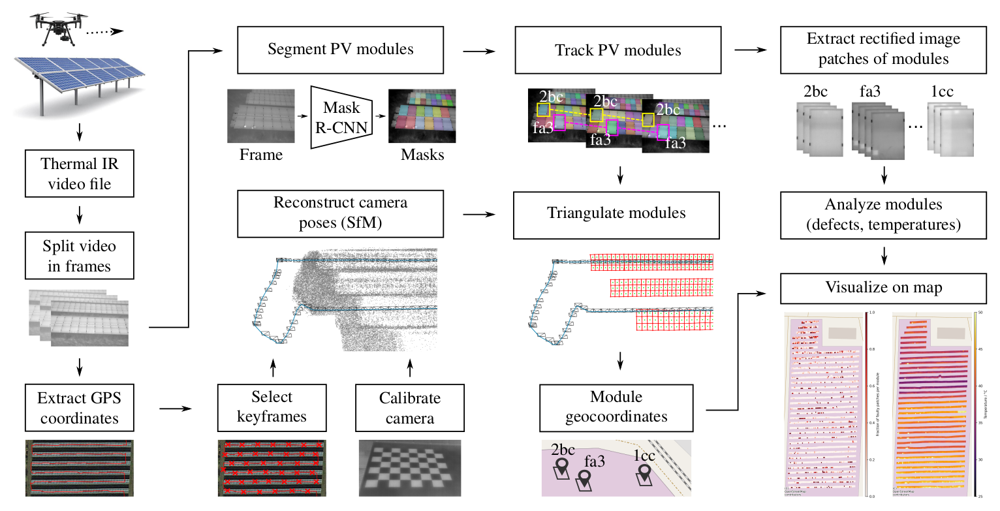

# PV-Mapper

This is the implementation of the PV-Mapper presented in the paper ["Computer Vision Tool for Detection, Mapping and Fault Classification of PV Modules in Aerial IR Videos"](https://arxiv.org/abs/2106.07314).

Its aim is to semi-automatically detect PV modules in aerial thermal infrared videos acquired by a drone. Detected modules are extracted from each individual video frame and associated with a plant ID that is manually provided.

The following diagram shows the components of the extraction tool.



Output is a directory containing multiple IR image patches for each PV module.

If you use PV-Mapper in your own research please consider citing us ([bibtex below](#citation)).

[update explanation of the tool]
[add overview description of the functionality]

## 1 Installation

### Step 1: Install prerequisites

To run the PV-Mapper you need a machine running Ubuntu 18.04 LTS / 20.04 LTS and a Nvidia CUDA-compatible GPU with the latest Nvidia drivers installed. Furthermore, you need to install [Docker CE](https://docs.docker.com/engine/install/ubuntu/) and the [Nvidia container toolkit](https://github.com/NVIDIA/nvidia-docker).

### Step 1: Get source code

Clone the Git repository to your machine
```
git clone https://github.com/LukasBommes/PV-Mapper
```

### Step 2: Download Mask R-CNN model files

The tool uses a pretrained [Mask R-CNN](https://github.com/matterport/Mask_RCNN) for PV module detection. Download the pretrained Mask R-CNN model weights from [here](https://drive.google.com/file/d/1F0GiR8QpKZEHV-4wtfbPeE5dvIiOeIG3/view?usp=sharing), extract the zip archive and place the folder "pv_modules20210521T1611" under `extractor/segmentation/Mask_RCNN/logs`. The resulting directory structure should look like follows:
```
|-- extractor/segmentation/Mask_RCNN/logs
                                        |-- pv_modules20210521T1611
                                            |-- events.out.tfevents.1621613480.27049cbf8e56
                                            |-- events.out.tfevents.1621782508.27049cbf8e56
                                            |-- mask_rcnn_pv_modules_0060.h5
                                            |-- mask_rcnn_pv_modules_0120.h5
```

### Step 3: Build Docker image

We user Docker to provide a consistent environment for the PV-Mapper. When building the provided Docker image all required dependencies, e.g., Python, CUDA, Tensorflow, and OpenSfM, are installed and configured automatically. There are two ways to use the Docker image: A) building the image from the provided Dockerfile, or B) load a prebuilt image.

Note, that you need to build/load the image only once. Afterwards, you can run the Docker image as specified in the [usage section](#step-1-run-docker-image).

#### Variant A: Build image from source

To build the Docker image from the provided Dockerifle run the following command from the root directory of PV-Mapper
```
sudo docker build . --tag=pvextractor-geo
```

#### Variant B: Load prebuild image

Alternatively, you can download a prebuilt Docker image from [here](https://drive.google.com/file/d/1ksjtbYPbpkMeZbChfqtSVkXBKHAq9Nbo/view?usp=sharing). Place the tar archive in the project's root directory an load the Docker image by executing
```
sudo docker load < pvextractor-geo.tar
```
Note, that the image was built on a machine with Ubuntu 20.04 LTS. Transferability to other operating systems is not guaranteed. If you run into issue with the prebuild image, please build the image from source as specified above.


## 2 Hardware Setup

### Drone and camera model

We used a DJI matrice V200 drone with a [DJI Zenmuse XT2](https://www.dji.com/de/zenmuse-xt2) thermal camera (variant with 13 millimeter focal length) for the development of PV Mapper. We recommed using the same camera as compatibility with other camera models can not be guaranteed at the current development stage of the PV Mapper project.

If you still want to use a different camera model please read [Using a different camera model](#using-a-different-camera-model-optional).

In addition to IR videos the GPS position of the drone needs to be measured. The DJI matrice V200 measures its position at a rate of 1 Hz and automatically injects the GPS position into the Exif tags of the IR videos. If you use a different drone make sure the GPS positions are injected correctly in the Exif tags of the IR videos. See [Using a different camera model](#using-a-different-camera-model-optional) for additional information on this.

### Camera settings

PV Mapper expects as input multipage TIFF stacks, in which each page is a single-channel 16-bit radiometric TIFF image. Thus, when using DJI Zenmuse XT2, you have to set the IR video output format to "TIFF".

### Calibrate camera

PV Mapper requires calibrated parameters of a pinhole camera model for the georeferencing of PV modules. To obtain these parameters a camera calibration needs to be performed. Calibration needs to be performed only once for a camera.

Calibration requires a target similar to the one [here](https://docs.opencv.org/3.4/dc/dbb/tutorial_py_calibration.html) but usable in the IR spectrum. To this end, your target needs to be made of materials with different thermal emissivity. We obtained good results using black foil squares applied to a white polymer panel. Also make sure that images are as blur-free as possible with good contrast between white and black squares.

We provide a Jupyter notebook for camera calibration in `calibration/01_calibrate.iypnb`. Information on the usage is provided in the script. To run the calibration script, first start an interactive Docker session as described in [Run Docker Image](#step-1-run-docker-image). Then start jupyter lab in in the interactive Docker session with the command
```
jupyter lab --allow-root --ip=0.0.0.0 --port=8888
```
Open the displayed URL in the web browser on your machine. In jupyter lab navigate to `calibration` and open the `01_calibrate.ipynb` notebook.


## 3 Recording of IR videos

PV-Mapper requires IR videos of PV plants acquired by a drone in a specific manner, which we will briefly outline in the following.

[...]

[Requirements on the flight trajectory, scaning of rows, no rotations, etc.]
[images of possible flight configurations]


## 4 Usage

### Step 1: Run Docker image

You have to run the PV-Mapper in an interactive terminal session inside the Docker image that you built in the previous steps. Before doing so, make sure access control of your machine's X server is disabled by running
```
xhost +
```
This enables graphical output from the Docker container to be forwarded to your machine. Note, that you have to repeat this step every time you rebooted your machine.

To run the interactive terminal session inside the Docker container run the following command from the project's root directory
```
sudo docker run -it \
    --ipc=host \
    --env="DISPLAY" \
    --gpus=all \
    -v /tmp/.X11-unix:/tmp/.X11-unix:rw \
    -v "$(pwd)":/pvextractor \
    -v /storage:/storage \
    -p "8888:8888" \
    pvextractor-geo \
    bash
```
You can omit the `-p "8888:8888"` option if you do not plan to use jupyter lab inside the container. Jupyter labe is needed for example for camera claibration or to fine-tune the Mask R-CNN model contained in this tool.

If you encounter a "permission denied" error make the entrypoint script executable by running
```
chmod +x docker-entrypoint.sh
```
in the project root.

[explain what the mapping of storage-2 in the command above means and how the user can change the command to match his own purpose]


### Step 2: Place IR video files


### Step 3: Create config file

The config file specifies details of the PV plant, the input videos and the plant layout. An example is shown below.

#### Example

```
---
plant_name: Plant A
work_dir: /storage-2/pvextractor-georeferencing/Plant_A/workdir
video_dir: /storage-2/pvextractor-georeferencing/Plant_A/
groups:
- name: Sector_1
  video_fps: 8.0
  row_orientation: horizontal
  cam_params_dir: calibration/camera_8hz/parameters
  clusters:
  - cluster_idx: 0
    frame_idx_start: 205
    frame_idx_end: 1147
  - cluster_idx: 1
    frame_idx_start: 2021
    frame_idx_end: 2838
  - cluster_idx: 2
    frame_idx_start: 2905
    frame_idx_end: 3397
  settings:
    triangulate_pv_modules:
      max_module_depth: 30
    refine_triangulation:
      max_module_depth: 30

- name: Sector_2
  video_fps: 8.0
  row_orientation: horizontal
  cam_params_dir: calibration/camera_8hz/parameters
  clusters:
  - cluster_idx: 0
    frame_idx_start: 208
    frame_idx_end: 2512
  settings:
    prepare_opensfm:
      frame_selection_gps_distance: 0.75
    refine_triangulation:
      merge_threshold_image: 7
      merge_threshold_world: 0.2

# list of tasks to perform
tasks:
  - split_sequences
  - segment_pv_modules
  - track_pv_modules
  - crop_and_rectify_modules
  #- filter_out_sun_reflections  # not yet implemented, leave commented out
  - prepare_opensfm
  - opensfm_extract_metadata
  - opensfm_detect_features
  - opensfm_match_features
  - opensfm_create_tracks
  - opensfm_reconstruct
  - triangulate_pv_modules
  - refine_triangulation
  - reorganize_patches
```

#### Video directory and working directory

#### Groups

#### Clusters

#### Settings

- refer to defaults.yml
- refer to OpenSfM settings
- explain how settings provided here overwrite the defaults

#### Tasks

- maybe move paragraphs from below here OR briefly explain what this list means and refer to next section

### Step 4: Run video processing pipeline

Once the config file is created, you can process the data by executing the following command inside the interactive session in the Docker container
```
python main.py testing/configs/config_plant_A.yml
```

To control which tasks are executed you can (un)comment tasks under `tasks` in the config file. Note, that you cannot skip any of the tasks, i.e. you will have to run each tasks at least once in the order specified in the config file.

We recommend to first uncomment the steps "split_sequences", "segment_pv_modules", "track_pv_modules", "crop_and_rectify_modules" and commenting all subsequent steps. These are preprocessing steps. You should ensure the correctness of the output of these steps before continuing with the remaining processing steps. To continue, comment out the first four steps and uncomment the remaining steps. Rerun `python main.py testing/configs/config_plant_A.yml`.


### Step 5: Visualize results

We provide a script `extractor/mapping/plot_reconstruction.py` for plotting the reconstructed camera poses, PV modules and map points. You can use this script to validate whether your PV plant was reconstructed and georeferenced correctly.

To this end, run the script from within the interactive Docker session and provide the `work_dir` of the plant
```
python plot_reconstruction.py "/storage-2/pvextractor-georeferencing/Plant_A/workdir"
```
You may inspect additional optional arguments by running 
```
python plot_reconstruction.py -h
```


## 5 Output directory structure

After completing a processing task a new subdirectory with results of that task will be created under the `work_dir` specified in the config file. E.g. after running the `split_sequences` tasks, there will be a new directory called `splitted`. Whenever you rerun a task, the respective subdirectory is deleted automatically before that task starts.

Note, that the directory tree below only shows important files and subdirectories. We will briefly explain them below.

```
/workdir
  |-- splitted
  |    |-- timestamps.csv
  |    |-- gps
  |    |     |-- gps.csv
  |    |     |-- gps.json
  |    |     |-- gps.kml
  |    |-- preview
  |    |     |-- frame_000000.jpg
  |    |     |-- frame_000001.jpg
  |    |     |-- ...
  |    |-- radiometric
  |    |     |-- frame_000000.tiff
  |    |     |-- frame_000001.tiff
  |    |     |-- ...
  |-- segmented
  |    |-- preview.avi
  |    |-- ...
  |-- tracking
  |    |-- tracks_preview.avi
  |    |-- tracks.csv
  |-- patches
  |    |-- meta.pkl
  |    |-- preview
  |    |     |-- ...
  |    |-- radiometric
  |    |     |-- ...
  |-- mapping
  |    |-- cluster_000000
  |    |     |-- reconstruction.json
  |    |     |-- ...
  |    |-- cluster_000001
  |    |     |-- reconstruction.json
  |    |     |-- ...
  |    |-- ...
  |    |-- module_geolocations_refined.geojson
  |    |-- ...
  |-- patches_final
  |    |-- preview
  |    |     |-- ...
  |    |-- radiometric
  |    |     |-- 840d60c7-e634-45be-9043-48110873c8e4
  |    |     |     |-- frame_010401_mask_000010.tiff
  |    |     |     |-- frame_010402_mask_000009.tiff
  |    |     |     |-- frame_010403_mask_000007.tiff
  |    |     |     |-- ...
  |    |     |-- 05bee5f1-9d66-4ac7-aee4-c724d59663b1
  |    |     |     |-- ...
  |    |     |-- ...
```

### splitted (split_sequences)

Contains the individual IR video frames as 16-bit TIFF images and additional 8-bit JPEG preview images. The `gps.csv` and `gps.json` files contain the longitude, latitude, and altitude (in this order) of each video frame. The `timestamps.csv` contains timestamps of each video frame.

### segmented (segment_pv_modules)

Contains results of the Mask R-CNN instance segmentation model applied to each video frame. Specifically, this directory contains binary segmentation masks of PV modules, bounding boxes and preview images. To validate correctness of the instance segmentation you can look at the preview video in `preview.avi`.

### tracking (track_pv_modules)

Contains the results of PV module tracking over subsequent video frames. The `tracks.csv` contains the frame name, mask name, tracking ID, and module center point in the image (x, y in pixels). Each PV module has a unique tracking ID that stays constant over subsequent video frame, in which the module is visible. To validate correctness of the module tracking you can look at the preview video in `tracks_preview.avi`.

### patches (crop_and_rectify_modules)

Contains the cropped and rectified image patches of each PV module. The `preview` directory contains 8-bit JPEG preview images and the `radiometric` directory the respective 16-bit TIFF images. For each PV module there is a directory named after the module's tracking ID, which contains the individual image patches showing the same module in subsequent video frames. The `meta.pkl` is a Python pickle file, containing additional information about each image patch, such as the image coordinates of the module's center point, the bounding quadrilateral that was fit to the module's segmentation mask, and the homography used to rectify the module image.

### mapping (prepare_opensfm, ..., refine_triangulation)

Contains the inputs and outputs of the tasks relating to the georeferencing of PV modules, which is performed using [OpenSfM](https://github.com/mapillary/OpenSfM). For each cluster configured in the config file there is a subdirectory, which contains the OpenSfM dataset for that cluster and which has the structure described [here](https://opensfm.org/docs/dataset.html). Most notably, each of these subdirectories contains the `reconstruction.json` file with the reconstructed camera poses and 3D map points produced by OpenSfM.<br>
The main result stored in the mapping directory is a GeoJSON file `module_geolocations_refined.geojson`. This file follows the [GeoJSON specification](https://datatracker.ietf.org/doc/html/rfc7946) and contains a feature collection of polygons and points for each PV module. The polygon resembles the longitude, latitude and altitude of the four corner points of the PV module in [WGS 84](https://epsg.io/4326) coordinates. The point is the geocoordinate of the module's center point. Each polygon and each point have a `track_id` property, which is the tracking ID of the respective PV module.

### patches_final (reorganize_patches)

This directory has the same overall structure as the `patches` directory, but considers the merging of tracking IDs. Merged tracking IDs occur when the same PV module has two different tracking IDs, which can happen occasionally due to a tracking error. These duplicates are identified during the georeferencing procedure. If for example the trackings IDs `abc123` and `def456` belong to the same module, there will be only one directory in the `patches_final` directory named after the first tracking ID (`abc123`), which contains all module images of both subfolders `abc123` and `def456` from the `patches` directory.


## 6 Current Limitations

### Plant layouts

PV Mapper works best for large-scale ground-mounted PV plants with regular row-based layouts. In principle, plants with irregular layouts or non-row based layouts can also be processed. However, there are some limitations to this.

For example, when scanning large arrays of densely packed PV modules (as common on large rooftops), GPS accuracy becomes important. We found that the accuracy of standard GPS is not sufficient and a more accurate RTK-GPS is required.

Another issue occurs with rooftop plants, where there are more obstructions than in a ground-mounted plant, e.g. windows, chimneys, piping, etc. In these cases PV moudle segmentation by Mask R-CNN is likely to fail as lots of false positives are generated. This is because we trained Mask R-CNN on a dataset containing only ground-mounted PV plants. Future versions of PV Mapper should consider this by re-training the Mask R-CNN on a larger corpus of PV plants including rooftop plants. If you want to use PV Mapper for such rooftop plants, you need to fine-tune Mask R-CNN yourself for the time being as described in [Train the Mask R-CNN model](#train-the-mask-r-cnn-model-optional).

### OpenSfM reconstruction failures

Scanning individual PV plant rows from low altitude is a challenging scenario for reconstruction with openSfM. Furthermore, we solely use IR imagery, which has a lower resolution and is more blurry than visual imagery, making the reconstruction more difficult.<br>
Thus, the reconstruction procedure can fail leading to corrupted 3D reconstructions and PV module locations. We noted that this occurs quite frequently and requires tuning of the settings for the OpenSfM reconstruction. Splitting a longer video sequence into smaller clusters of at most 2000 images can further improve robustness of the reconstruction procedure. A long sequence should also be split into clusters whenever there are discontinuities in the video, e.g. due to battery changes, or sudden movements. This prevent the reconstruction from failing at those video frames.


## 7 Using a different camera model (optional)

While we do not recommend using a different camera, in theory PV Mapper works with other cameras with the following minimum specifications:
- Frame rate: >= 8 Hz
- Image resolution: >= 640 px * 512 px

If you use a different camera, you will also have to modify the conversion of raw radiometric values to Celsius values, which is implemented in the `to_celsius` method in `extractor/common.py`. This method takes as input a 2D numpy.ndarray (dtype float), resembling the raw radiometric video frame, and outputs a 2D numpy.ndarray (dtype float) of the video frame in Celsius scale. Please refer to the user maual of your camera for the conversion formula.

Furthermore, you will have to make sure to provide IR videos and GPS position measurements in the correct formats. The IR videos need to be multipage TIFF stacks, where each page is one video frame. Each page must be a single-channel 16-bit TIFF image containing the raw radiometric measurements (before conversion into Celsius scale) of the video frame. Furthermore, each page of the TIFF stack needs to contain the measured GPS position of the drone in its [Exif tags](https://exiftool.org/TagNames/EXIF.html). Specifically, the values `GPSLatitude`, `GPSLongitude`, `GPSLatitudeRef`, `GPSLongitudeRef`, `GPSAltitude` need to be set in the `GPSInfo` tag. Furthermore, each TIFF page needs to contain a timestamp in the `DateTimeOriginal` and the `SubsecTimeOriginal` Exif tags.

If your camera does not provide the correct output format of the IR videos or you find it difficult to inject the required data into the Exif tags, there is an easier alternative. Simply skip the first step of the processing pipeline `split_sequences` and manually provide the individual video frames and extracted GPS positions in the `splitted` subdirectory of the working directory following the format described [here](#splitted-split_sequences). Note, that you do not need the `timestamps.csv` and `gps.kml` files.


## 8 Train the Mask R-CNN model (optional)

The project uses Mask R-CNN for instance segmentation of PV modules in IR video frames. It is pretrained on a large PV module dataset. However, if you encounter issues with the accuracy of the Mask R-CNN model, you may wish to fine-tune the model on your own dataset. For this, we recommend annotating data using the [Grid Annotation Tool](https://github.com/LukasBommes/Grid-Annotation-Tool). Data labelled with this tool canbe directly used for training the Mask R-CNN model.

To train/fine-tune Mask R-CNN start jupyter lab in the interactive Docker session
```
jupyter lab --allow-root --ip=0.0.0.0 --port=8888
```
and open the displayed URL in the web browser on your machine. In jupyter lab navigate to `extractor/segmentation` and open the `train.ipynb` notebook.

Prior to training the model with this script, you may need to edit the training config in `extractor/segmentation/configs.py` in the same directory. Also make sure the training dataset is available at the location specified in `DATASET_PATH` in `extractor/segmentation/configs.py`.

The training dataset should contain the following two folders:
- `images_radiometric`: 16-bit radiometric images taken from the splitted IR video file (e.g. \*.SEQ file)
- `annotations`: Corresponding \*.json file with annotations for each image. It can be created with the [Grid Annotation Tool](https://github.com/LukasBommes/Grid-Annotation-Tool).


## 9 About

This software is written by Lukas Bommes, M.Sc. - [Helmholtz Institute Erlangen-Nürnberg for Renewable Energy (HI ERN)](https://www.hi-ern.de/hi-ern/EN/home.html)

### License

This project is licensed under the MIT License - see the [LICENSE](https://github.com/LukasBommes/PV-Mapper/blob/master/LICENSE) file for details.

### Citation

This repository implements our research presented in the following two papers. If you use PV-Mapper in your own research please cite these works.

Paper 1: "Computer Vision Tool for Detection, Mapping and Fault Classification of PV Modules in Aerial IR Videos" [[Wiley PIP](https://onlinelibrary.wiley.com/doi/10.1002/pip.3448), [ArXiv](https://arxiv.org/abs/2106.07314)]

```
@article{Bommes.2021,
  author  = {Bommes, Lukas and Pickel, Tobias and Buerhop-Lutz, Claudia and Hauch, Jens and Brabec, Christoph and Peters, Ian Marius},
  title   = {Computer vision tool for detection, mapping, and fault classification of photovoltaics modules in aerial {IR} videos},
  journal = {Progress in Photovoltaics: Research and Applications},
  volume  = {29},
  number  = {12},
  pages   = {1236--1251},
  year    = {2021}}
```

Paper 2: "" [[Wiley PIP](), [ArXiv]()]

```
[second paper has not been published yet]
```