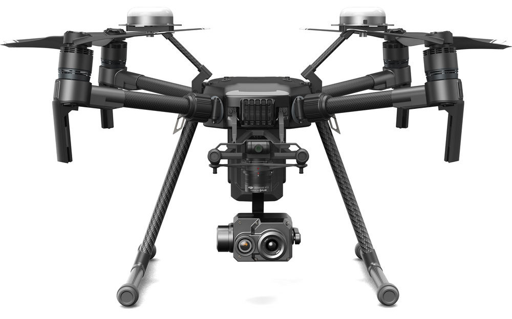
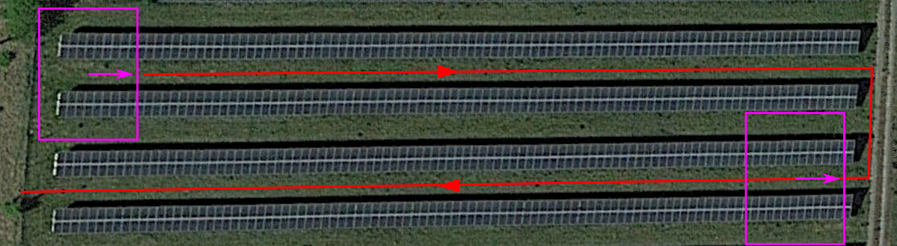
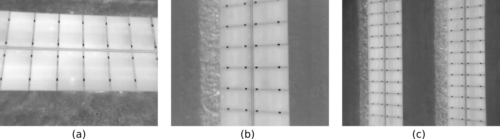
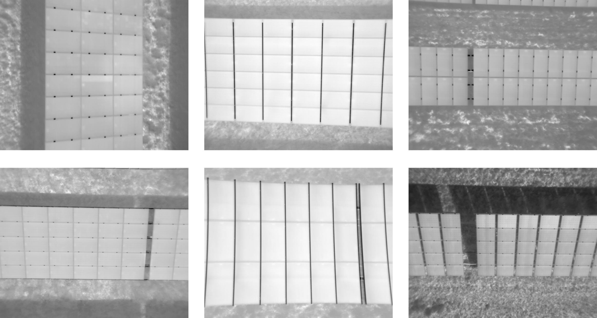

.. _using_own_data:

Using Your Own Data
===================

This section explains how to record IR videos of your own PV plant with your own camera and drone hardware in a way that is compatible with PV Hawk.

.. _hardware_setup:

Hardware setup
--------------

For the development and testing of PV Hawk we used a DJI Matrice 210 drone with the `DJI Zenmuse XT2 <https://www.dji.com/de/zenmuse-xt2>`_ thermal/visual camera (variant with 13 mm focal length). However, PV Hawk should work with any other drone and camera as long as some basic requirements are fullfilled.

.. _drone_requirements:

Drone requirements
^^^^^^^^^^^^^^^^^^

Our drone records its GPS longitude and latitude in WGS 84 coordinates at a rate of 1 Hz. PV Hawk performs internally a piecewise linear interpolation of the GPS trajectory to match the GPS measurement rate to the higher video frame rate. A higher measurement rate than 1 Hz is still desirable. Further, we ignore the altitude measurement of our drone as it is based on the barometer alone and not accurate enough. PV Hawk can handle this missing altitude. However, results will be more accurate and stable when an accurate altitude measurement is provided. Thus, we recommend using Real-time kinematic (RTK) GPS, which provdies centermeter-accurate longitude, latitude and altitude measurements.

Camera requirements
^^^^^^^^^^^^^^^^^^^

While the Zenmuse XT2 provides both a thermal IR and a visual stream, we only use the IR stream. Thus, a dual IR/visual camera is not required. Your thermal IR camera needs a resolution of >= 640 px * 512 px and a frame rate of >= 8 Hz. The temperature range has to match the expected temperatures, which should be between -20 °C and 200 °C. Note, that some cameras automatically change the gain depending on the temperatures measured. Make sure that the gain is kept constant during the entire measurement of a PV plant. The focal length should be choosen so that a sufficient number of PV modules can be captured at a time. The exemplary video frames :ref:`below <video_recording>` should give you an idea of how the optical characteristics of your camera should be choosen.

   DJI Matrice 210 with Zenmuse XT2 is one possible hardware setup for PV Hawk. Other drones and cameras can be used as they meet some minimum requirements. (Image source: www.brandonoptics.com)

.. _camera_calibration:

Camera calibration
------------------

PV Hawk requires calibrated parameters of a pinhole camera model for the georeferencing of PV modules. To obtain these parameters a camera calibration needs to be performed. Calibration needs to be performed only once for a camera.

Calibration requires a target such as the one in :numref:`calibration_target`. While the pattern is a standard checkerboard (see `here <https://docs.opencv.org/3.4/dc/dbb/tutorial_py_calibration.html>`_), the target must be visible in the IR spectrum. Simply printing the target onto paper does not work. Instead, the target needs to be made of materials with different thermal emissivity for the black and white squares. We obtained good results using black foil squares applied to a white polymer panel. Also make sure that images are as blur-free as possible with good contrast between white and black squares.

We provide a Jupyter notebook for camera calibration in `calibration/01_calibrate.iypnb`. Information on the usage is provided in the notebook. To run the calibration notebook, first start an interactive Docker session as described in :ref:`run-the-docker-image`. Then start jupyter lab in in the interactive Docker session with the command

.. code-block:: console

  jupyter lab --allow-root --ip=0.0.0.0 --port=8888

Note, that the port number must match the port forwarded when starting the Docker container. Open the displayed URL in the web browser on your machine. In jupyter lab navigate to `calibration` and open the `01_calibrate.ipynb` notebook. Make necessary changes, and then run the notebook.

.. _calibration_target:
.. figure:: images/calibration_target.png

  Exemplary target for calibrating a thermal IR camera. (a) shows a visual image and (b) and (c) are thermal images.

[maybe it is sufficient to provide the rough parameters, i.e. correct focal length, perfect image center and zero distortion]
[mention that these are only initial parameters and they are further optimized during the OpenSfM procedure]
[mention option to perform calibration with a custom script or matlab and provide camera matrix and distortion coefficients manually as JSON file]

.. _video_recording:

Video recording
---------------

While PV Hawk is flexible with respect to the way IR videos are recorded, several rules must still be followed to ensure optimal results. In general, you should scan PV plant rows one or two at a time as indicated in figure :numref:`flight_modes_single_row` and :numref:`flight_modes_double_row`. Resulting video frames are shown in :numref:`example_frames`. Scanning two rows at a time increases throughput but also reduces the resolution of extracted PV module images. While the rows can be scanned in an arbitrary order, we recommend sequential scanning to simplify the subsequent manual configuration. The drone flight can be automated or carried out manually.

We recommend to orient the camera facing vertically downwards (nadir) at all times. This improves robustness of the processing pipeline as we can set a vertical orentiation prior in OpenSfM when reconstructing the camera trajectory. However, at the expense of lower robustness you can also choose a non-nadiral camera angle. This is useful, for instance, to prevent sun reflections on the PV modules.

.. _flight_modes_single_row:
.. figure:: images/flight_modes/flight_modes_single_row.png

   Scanning of a single PV plant row at a time. Boxes indicate the camera viewport and arrows the up-direction of the video frame. The camera is oriented so that the plant row lies either horizontal (cyan box) or vertcial (green box) in the video frame. Important is not to rotate the drone/camera at the end of the row. Instead, keep the heading constant and fly backwards as indicated by the second set of boxes.
  
.. _flight_modes_double_row:

  Simultaneous scanning of two PV plant rows by increasing the flight altitude. Again, the heading must be kept constant when changing rows.

.. _example_frames:

  Exemplary IR video frames for (a) horizontal scanning of a single row (cyan box above), (b) vertical scanning of a single row (green box above), and (c) scanning of two rows at a time (magenta box above).

In the following, we list all the rules you should follow when recording IR videos for PV Hawk. We differentate between `hard rules` and `soft rules`. If you do not follow the hard rules PV failure is guaranteed. Not following one of the soft rules may not result in immediate failure, but can decrease robustness of the processing piepline.

- Hard rules:
   - Never tilt the camera, instead keep it rigidly oriented w.r.t. the drone.
   - Never change the heading of the drone absruptly, e.g. never yaw the drone at the end of a row.
   - Move the drone a sufficient distance in at least two orthogonal directions, e.g. north/south and east/west. Flying only along a line is insufficient.
   
- Soft rules:
   - Point the camera down vertically (nadiral)
   - Keep the viewing angle vertical enough so that no rows become visible in the background (see :numref:`example_frames_bad` a)   
   - Do not truncate the scanned row at the top/bottom of the video frame (see :numref:`example_frames_bad` b) except when you change to the next row
   - No neighbouring rows should intrude the video frame at the top or bottom (see :numref:`example_frames_bad` c) except when you change to the next row
   - Avoid abrupt movements (fly with constant velocity, slow enough to prevent motion blur)   
   - Avoid scanning the same plant row multiple times
   - Move the camera monotonically along each row, i.e. do not move backward
   - Maintain a constant altitude (if your GPS provides no accurate altitude measurement) or better maintain a constant height over the modules (only if your GPS provides an accurate altitude measurement)
   
.. _example_frames_bad:
.. figure:: images/example_frames_bad.png

  Examples of invalid video frames: (a) Background rows visible, (b) scanned row truncated, and (c) neighbour row intruding.

Below are some images and videos of valid recordings.

.. _other_example_frames:

  Examples of valid IR video frames.

.. video:: _static/videos/single_row_horizontal.mp4
   :width: 345
   :height: 276

.. video:: _static/videos/single_row_vertical.mp4
   :width: 345
   :height: 276

.. video:: _static/videos/double_row_vertical.mp4
   :width: 345
   :height: 276

As mentioned earlier, you can choose a non-nadiral camera angle to prevent sun reflections on the PV modules. However, you may not always be able to completely prevent sun reflections. For this case, we provide a sun reflection filter in the `PV Hawk Viewer <https://github.com/LukasBommes/PV-Hawk-Viewer>`_.

Weather conditions are another important aspect to consider. For optimal results, the sky should be cloudless and solar irradiance should be above 700 Watt/m². Lower irradiance typically results in IR images with low contrast, which is challenging for the automated processing. Furthermore, module anomalies are less visible at low irradiance.

.. note::
  We limit the description above to row-based PV plants as we have not yet extensively tested PV Hawk on non-row-based PV plants (see also :doc:`limitations`). While the rules above also apply to non-row-based PV plants, you may have to consider additional aspects. For example, scanning a large array of PV modules may require multiple overlapping "sweeps".

.. _dataset-creation-from-videos:

Dataset creation from videos
----------------------------

After recording, you need to convert the thermal IR videos of your PV plants into a format compatible with by PV Hawk. The directory tree below shows the various files required by PV Hawk. The directory must be named `splitted` and must be located in the `work_dir` specified in the config file.

.. code-block:: text

  /workdir
    |-- splitted
    |    |-- timestamps.csv
    |    |-- gps
    |    |     |-- gps.json
    |    |-- radiometric
    |    |     |-- frame_000000.tiff
    |    |     |-- frame_000001.tiff
    |    |     |-- ...

As indicated, you have to provide each IR video frame as a single-channel TIFF image of unsigned 16-bit integer values in the `radiometric` subdirectory. The spatial resolution should correspond to the native resolution of your camera, i.e. do not perform any resizing. Furthermore, do not perform any rescaling of the values but simply provide the raw values output by your camera. PV Hawk will internally normalize the value range. Ensure that your camera outputs linearized temperature values, i.e. the raw image values must be mappable to temperatures by means of a linear transformation (multiplication by a gain factor and subtraction of an offset). While this is the default for IR cameras outputting TIFF images, it does not apply to some proprietory formats, such as the SEQ or radiometric JPEG format. Furthermore, make sure to name the images following the scheme `frame_xxxxxx.tiff` where `xxxxxx` is the frame index (incremented from zero) as 6-digit integer with leading zeros.

Furthermore, you must provide the GPS position of the drone at each video frame in a JSON file named `gps.json` in the `gps` subdirectory. The file must contain a list of lists, where each inner list is a triplet of [longitude, latitude, altitude] in WGS84 coordinates as shown below.

.. code-block:: text

  [
    [11.180329444444446, 48.613639722222224, 0.0],
    [11.180571349206538, 48.61362777777799, 0.0],
    ...,
    [11.179669479166668, 48.61309805555565, 0.0]
  ]
   
The GPS altitude may be zero if an accurate estimate is not available (see :ref:`drone_requirements`). For each video frame there must be one position. If your GPS measurement rate is lower than the video frame rate, you can replicate the same position for multiple frames. You should then use the pipeline task `interpolate_gps` to perform a piecewise linear interpolation and obtain a more accurate position estimate for each frame.

Finally, you should provide a `timestamps.csv` file, which contains the timestamp of each video frame in the exact same format shown below. The file is not immediately needed in PV Hawk. However, the PV Hawk Viewer uses it to estimate the flight duration and other quantitites.

.. code-block:: text

  2021-09-09T10:28:47.500000
  2021-09-09T10:28:47.530000
  ...
  2021-09-09T11:57:48.950000
  
.. note::
  If you use a DJI Zenmuse XT2 or compatible camera, you can configure the camera to output IR videos as multipage TIFF stacks. Place the TIFF stacks in a `videos` subfolder in your `work_dir` and run the pipeline task `split_sequences`. This will automatically generate the `splitted` directory with all dataset files.
